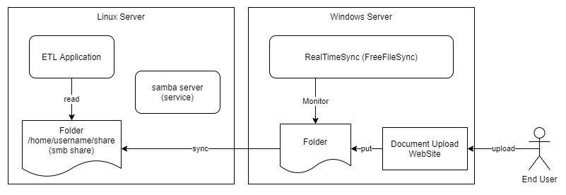
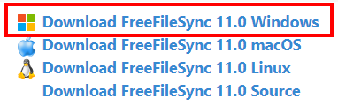
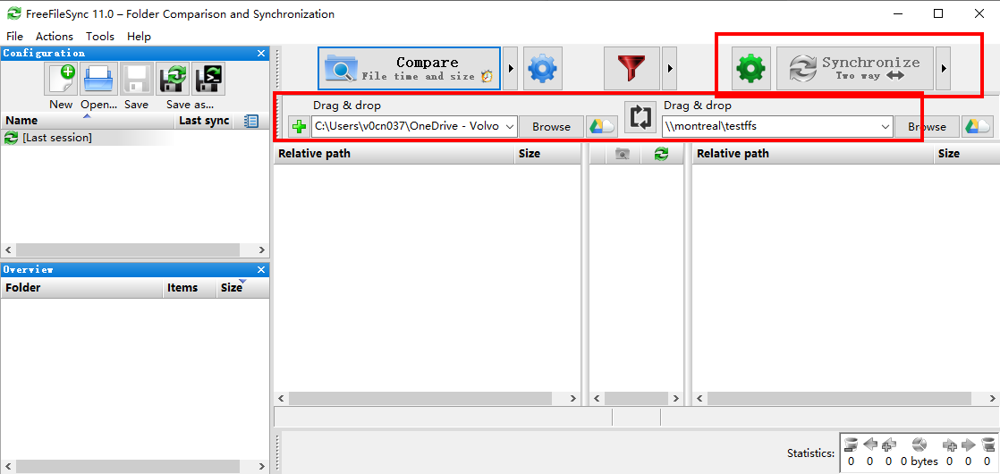
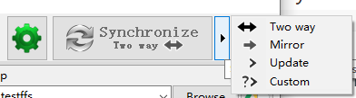

# Sync Files between Windows and Linux

## Background

We're facing one need that the application is running on one Linux (RedHat) server for report analysis, the ETL tool _Kettle_ expect to read source file uploaded to one local folder.

Instead of asking end user to upload file to Linux Server file system, our previous project had already built one Windows based web-tool (called Document Manager) to allow user download and upload files through browser, here we'd like to reuse the existing capability to make one working procedure to have file auto-sync to Linux Server.

## Solution Illustration



Key elements to be considered:

- Windows Server opens HTTPS to end user's network, allowing user accessing the web page and authenticate via SSO
- Install "FreeFileSync" on Windows Server
- Install samba server on Linux server, enable smbd service deamon on
- Base on ETL Application need, create destination folder in Linux server and configure samba share
- Test connection from Windows Server to Linux Server's file sync function via FreeFileSync (manually)
- Create real time monitor in Windows Server via ReamTimeSync setting

## Preparation

### Install FreeFileSync on Windows Server

Come to website: https://freefilesync.org/


Choose Download, then select the Windows version:



After installing, you should see below window when run the freefilesync application:



Note there are four options to the destination side:



In our scenario, we can choose "Mirror" instead of default "Two way".

### Install samba server on Linux Server (using Ubuntu as example)

A Samba file server enables file sharing across different operating systems over a network.

My environment is Ubuntu 20.04.1 LTS, the command can be different to the RedHat server, but the theory is similar.

#### Installing Samba

To install Samba, we can run:

```
sudo apt update
sudo apt install samba
```

Check Samba version:

```
samba --version
```

My result is "Version 4.11.6-Ubuntu"

Check if the installation was successful by running:

```
whereis samba
```

If you get following output, then it's OK:

```
samba: /usr/sbin/samba /usr/lib/x86_64-linux-gnu/samba /etc/samba /usr/share/samba /usr/share/man/man7/samba.7.gz /usr/share/man/man8/samba.8.gz
```

#### Setting Up Samba

Now Samba is installed, we can create a directory in Linux server for it to share, this folder will be used for applications running on Linux server to consume the synced files later:

```
mkdir /home/<username>/sambashare
```

My share folder is `/home/yasen/Documents/testffs`, this is depending on the needs from applications.

The configuration file for Samba is located at `/etc/samba/smb.conf`.

To add the new directory as a share, we can edit this configuration file using any text editor:

```
sudo gedit /etc/samba/smb.conf
```

At the bottom of the file, add following lines:

```
# add one folder share to freefilesync testing
[testffs]
path = /home/yasen/Documents/testffs
valid users = yasen
read only = no
browsable = yes
```

The meaning of we add above as:

- comment: a brief decription of the share
- path: the directory of the share to be used
- valid users: can set the authorized user (later we need to add this user's permission)
- read only: permission to modify the contents of the share folder is only granted when the value of this directive is `no`
- browsable: when set to `yes`, file managers such as Ubuntu's default file manager will list this share under "Network"

Restart Samba for new share to take effect:

```
sudo service smbd restart
```

If needed, update firewall rules to allow Samba traffic:

```
sudo ufw allow samba
```

#### Setting up User Accounts for Samba

As we put user name `yasen` as the valid user, we need to set up a Samba password for the user account. (the reason is Samba doesn't use the system account password).

```
sudo smbpasswd -a username
```

Here you can change `username` to the one you want to set.

Note: username used must belong to a system account, else it won't save.

#### Connecting to Share

On Ubuntu: Open up the default file manager and click _Connect to Server_ then enter:

```
smb://ip-address/sambashare
```

On macOS: in the finder menu, click _Go > Connect to Server_ then enter:

```
smb://ip-address/sambashare
```

On Windows, open up File Manager and edit the file path to:

```
\\ip-address\sambashare
```

You can just keep this way for later FreeFileSync configuration, or it's also OK to map this network path to one pre-defined local drive number, e.g. Z:


## Synchronization Configuration

